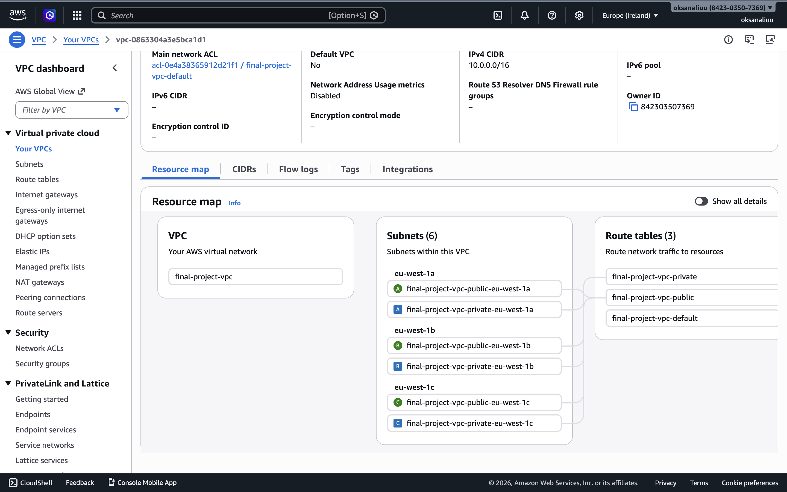
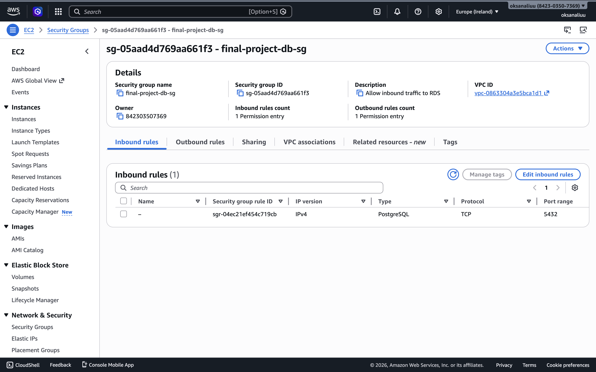
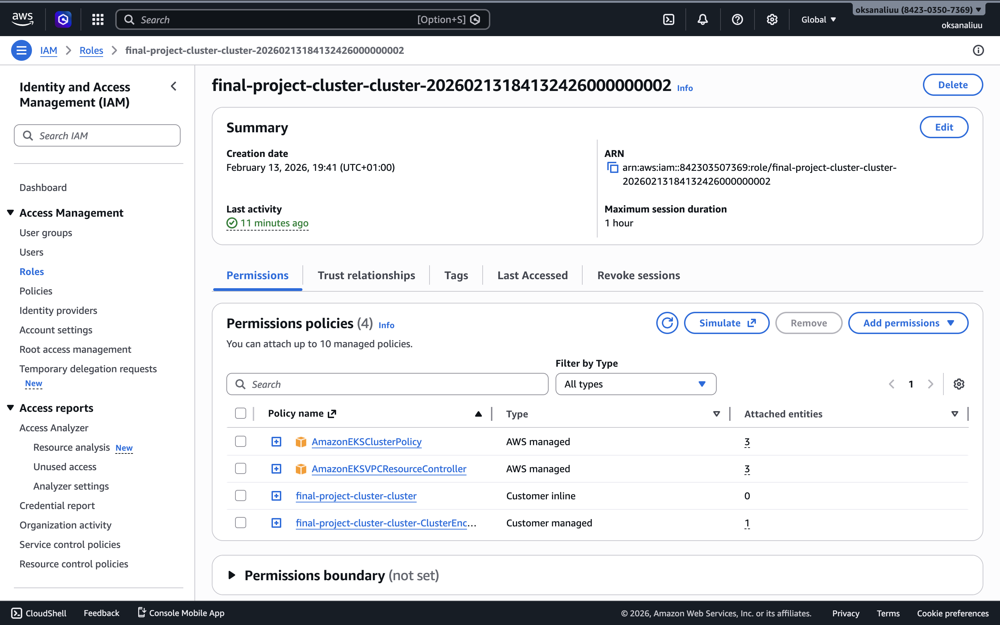
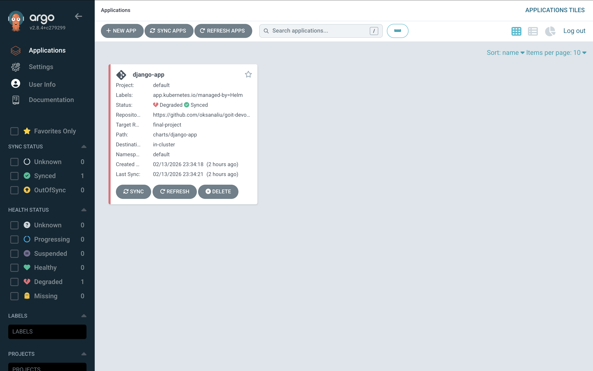
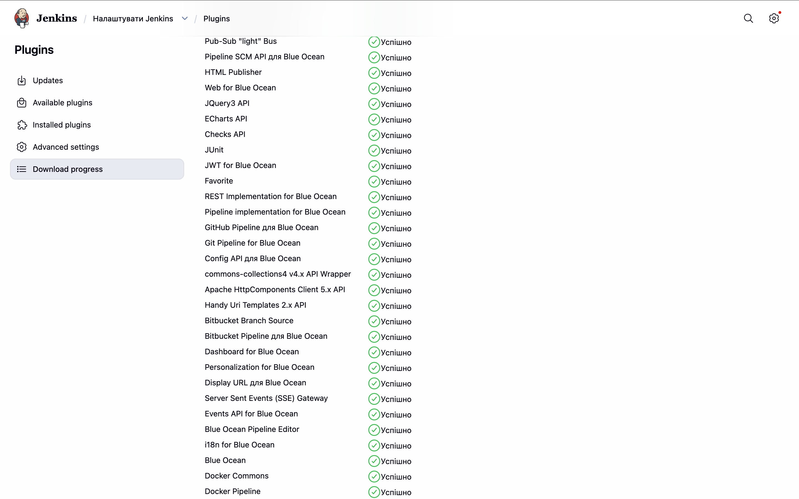
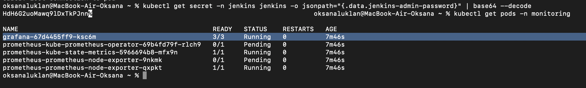
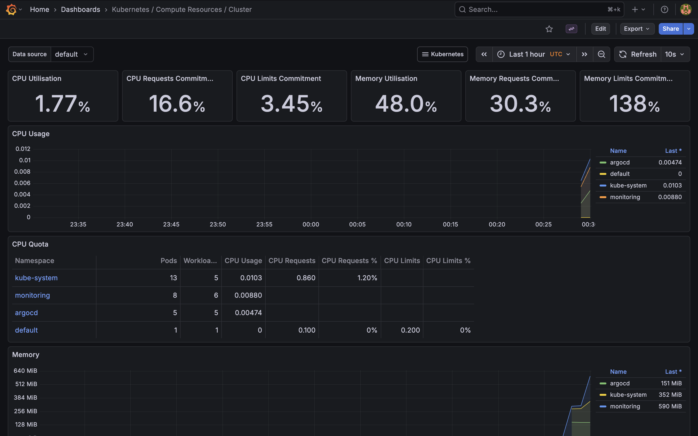

# Homework: Final DevOps Project.

Цей репозиторій містить фінальний проєкт курсу DevOps. Проєкт демонструє автоматизоване розгортання хмарної інфраструктури в AWS за допомогою Terraform, а також налаштування повного циклу CI/CD для веб-застосунку з використанням Jenkins та Argo CD.

## Як запустити проєкт

### Крок 1: Розгортання інфраструктури (Terraform)

Ініціалізуйте Terraform та застосуйте конфігурацію:

```bash
terraform init
terraform apply -auto-approve
```

### Крок 2: Налаштування доступу до кластера EKS

Оновіть локальний kubeconfig для підключення до створеного кластера:

```bash
aws eks update-kubeconfig --region eu-west-1 --name final-project-cluster
```

### Крок 3: Перевірка доступності сервісів (Port-Forwarding)

Перевірка доступності сервісів (Port-Forwarding)

## 1. Jenkins:

```bash
kubectl port-forward svc/jenkins 8080:8080 -n jenkins
```

Логін: admin, пароль можна отримати командою: kubectl exec --namespace jenkins -it svc/jenkins -c jenkins -- /bin/cat /run/secrets/additional/chart-admin-password

## 2. Argo CD:

```bash
kubectl port-forward svc/argo-cd-argocd-server 8081:443 -n argocd
```

## 3. Grafana:

```bash
kubectl port-forward svc/grafana 3000:80 -n monitoring
```

### Очищення

```bash
terraform destroy -auto-approve
```

## Технологічний стек

1. **Хмарний провайдер:** AWS
2. **IaaC:** Terraform (стейт зберігається в S3 + DynamoDB)
3. **Мережа:** VPC, Public/Private Subnets, NAT Gateway, Internet Gateway
4. **Обчислення:** Amazon EKS (Managed Node Groups)
5. **База даних:** Amazon RDS (PostgreSQL)
6. **Реєстр образів:** Amazon ECR
7. **CI/CD:** Jenkins, Argo CD (GitOps)
8. **Моніторинг:** Prometheus, Grafana

## Схема CI/CD Пайплайну

1. Push коду в GitHub (гілка final project).
2. Jenkins Pipeline автоматично запускається (використовуючи Docker плагіни).
3. Jenkins збирає Docker-образ застосунку (Django).
4. Jenkins пушить зібраний образ в Amazon ECR з новим тегом.
5. Jenkins автоматично оновлює файл values.yaml у репозиторії (змінює тег образу).
6. Argo CD фіксує зміни в Git-репозиторії та автоматично синхронізує (деплоїть) нову версію застосунку в EKS кластері.

## Результати роботи (Screenshots)

### Інфраструктура розгорнута в AWS за допомогою Terraform. Створено VPC з публічними та приватними підмережами, рознесеними по трьох зонах доступності. Налаштовано Internet Gateway та NAT Gateway для доступу приватних ресурсів до інтернету



### Доступ до ресурсів суворо обмежено. Налаштовані спеціальні IAM-ролі для EKS-кластера та Worker-нод із принципом мінімальних привілеїв. Створено Security Group для бази даних, яка дозволяє вхідний трафік на порт 5432 лише з внутрішньої мережі VPC.




### Впроваджено пайплайн неперервної інтеграції та доставки. Для управління розгортанням застосунку в EKS використовується Argo CD, який автоматично синхронізує стан кластера з Helm-чартами в репозиторії. Застосунок успішно задеплоєно та працює.




### Для збору метрик та моніторингу стану кластера EKS розгорнуто стек Prometheus & Grafana. Налаштовано збір метрик з Worker-нод та подів, візуалізація ресурсів (CPU/Memory) виведена на Grafana Dashboard.



