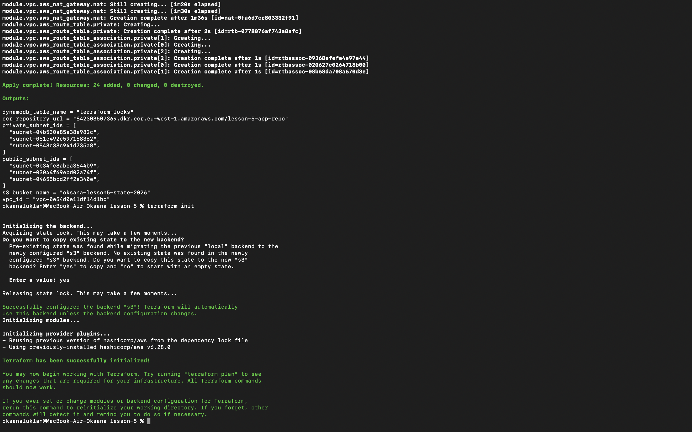

# Lesson 5: AWS Infrastructure with Terraform

Цей проект розгортає хмарну інфраструктуру на AWS за допомогою Terraform.

## Структура проекту

- **modules/s3-backend**: Налаштування S3 бакета для збереження стану (State) та DynamoDB для блокування.
- **modules/vpc**: Створення мережі (VPC), публічних та приватних підмереж, NAT Gateway та Internet Gateway.
- **modules/ecr**: Створення репозиторію ECR для Docker-образів з автоматичним скануванням.

## Команди для запуску

1. **Ініціалізація**: Завантаження модулів та налаштування бекенду.

```bash
   terraform init
```

2. **Планування**: Перегляд змін перед застосуванням.

```bash
   terraform plan
```

3. **Застосування**: Створення інфраструктури в хмарі.

```bash
   terraform apply
```

4. **Знищення**: Видалення всіх ресурсів (щоб не платити за NAT Gateway).

```bash
   terraform destroy
```

## Результати роботи (Screenshots)

Підтвердження успішної ініціалізації віддаленого бекенду (S3 + DynamoDB):


