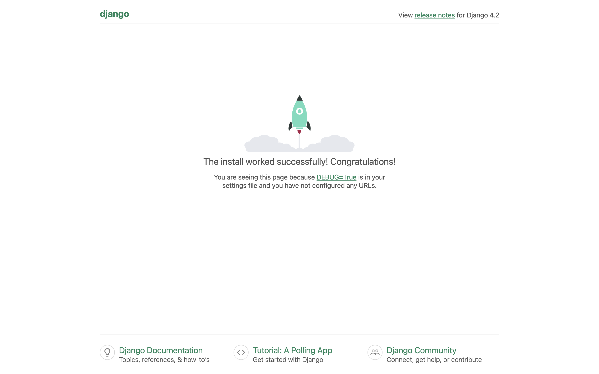

# Homework: Lesson 7 (AWS EKS + Helm)

Цей репозиторій містить інфраструктуру та код для розгортання Django-застосунку в кластері Kubernetes на AWS.
Для керування інфраструктурою використовується Terraform, для контейнеризації — Docker, а для деплою — Helm.

## Як запустити проєкт

### Крок 1: Створення інфраструктури (Terraform)

Розгортання мережі (VPC), ECR (реєстр для Docker образів) та EKS кластеру.

```bash
cd lesson-7

terraform init
terraform apply -auto-approve
```

Налаштування доступу до кластера:

```bash
aws eks update-kubeconfig --region eu-west-1 --name lesson-7-cluster
```

### Крок 2: Збирання Docker-образу

```bash
# Логін в ECR
aws ecr get-login-password --region eu-west-1 | docker login --username AWS --password-stdin <ACCOUNT_ID>.dkr.ecr.eu-west-1.amazonaws.com

# Збірка та Push
docker build --platform linux/amd64 -t lesson-7-django-repo ../django
docker tag lesson-7-django-repo:latest <ECR_URL>:latest
docker push <ECR_URL>:latest
```

### Крок 3: Деплой (Helm)

```bash
helm install my-site ./charts/django-chart
```

### Крок 4: Перевірка

```bash
kubectl get service my-site-django
```

### Очищення

```bash
helm uninstall my-site
terraform destroy -auto-approve
```

## Результати роботи (Screenshots)


