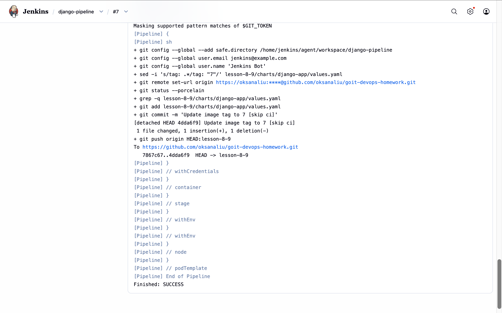

# Homework: Lesson 8-9 (Jenkins + Helm + Terraform + Argo CD)

Цей проєкт реалізує повний автоматизований цикл CI/CD для Django-застосунку з розгортанням в Amazon EKS кластері.

## Архітектура CI/CD

1. **Infrastructure as Code (IaC):** Весь стек (VPC, EKS, ECR, Jenkins, Argo CD) розгортається через **Terraform**.
2. **CI Pipeline (Jenkins):** Jenkins використовує Kubernetes Agents (Kaniko) для збірки Docker-образу, пушить його в **Amazon ECR** та автоматично оновлює тег версії у Helm-чарті в GitHub.
3. **CD (Argo CD):** Відстежує зміни в репозиторії та автоматично синхронізує стан кластера з Helm-чартом.

## Як запустити проєкт

### Крок 1: Створення інфраструктури (Terraform)

Розгортання мережі (VPC), ECR (реєстр для Docker образів) та EKS кластеру.

```bash
cd lesson-7

terraform init
terraform apply -auto-approve
```

### Крок 2: Налаштування доступу до Kubernetes:

```bash
aws eks update-kubeconfig --region eu-west-1 --name lesson-8-9-cluster
```

### Крок 3: Доступ до Argo CD:

```bash
kubectl port-forward svc/argo-cd-argocd-server -n argocd 8081:443
```

Логін: admin, пароль можна отримати через Secret argocd-initial-admin-secret.

### Очищення

```bash
terraform destroy -auto-approve
```

## Результати роботи (Screenshots)

### Jenkins: Всі етапи Pipeline (Build, Push, Update Git) проходять успішно (Build #7).


### ECR: Образи зберігаються з унікальними тегами, що відповідають номеру збірки в Jenkins.



### Argo CD: Застосунок має статус Healthy, що підтверджує успішне розгортання в Kubernetes.


## Cхема CI/CD

1. **Push коду в GitHub (гілка lesson-8-9).**
2. **Jenkins Pipeline запускається через Kubernetes Agent.**
3. **Kaniko збирає Docker-образ Django.**
4. **Jenkins пушить образ в Amazon ECR з тегом збірки (наприклад, :7).**
5. **Jenkins оновлює values.yaml у GitHub, змінюючи тег на новий.**
6. **Argo CD бачить зміни в Git і автоматично розгортає нову версію в EKS.**
