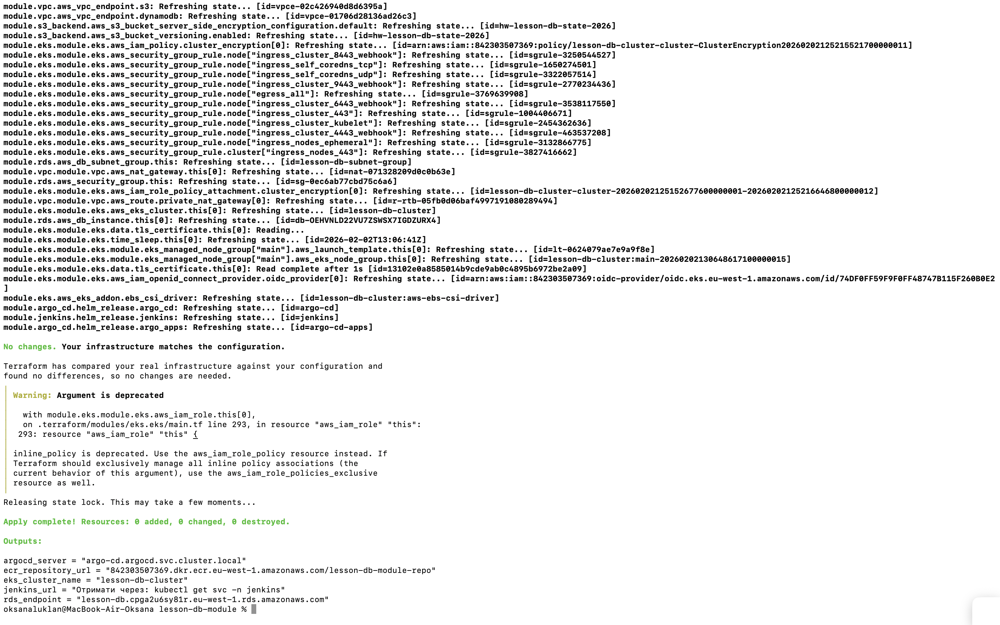
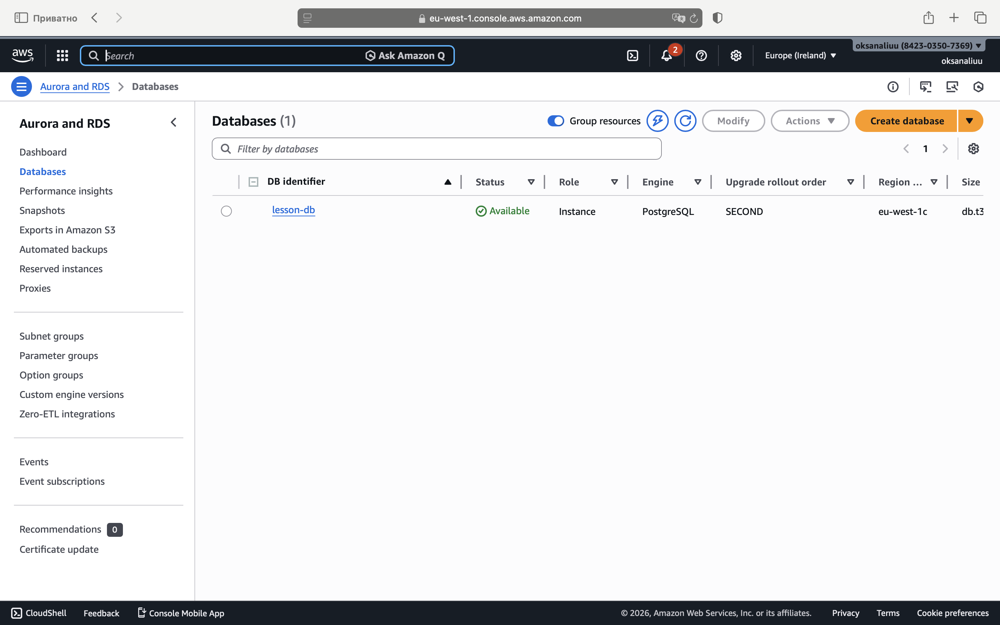
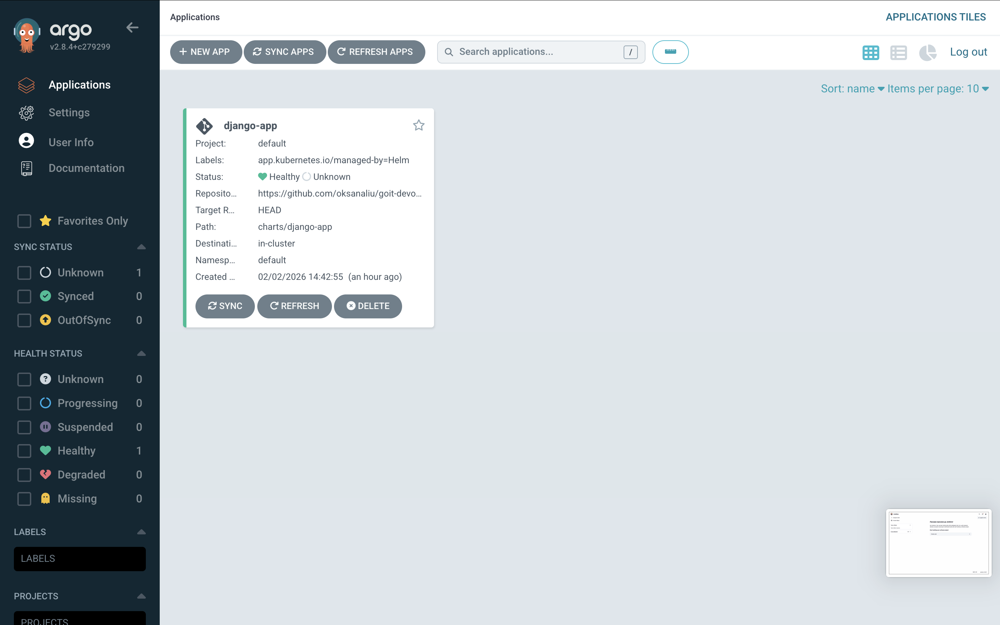

# Homework: Lesson 10 (Infrastructure as Code: AWS EKS, RDS (Aurora/Standard), Jenkins & ArgoCD).

Цей репозиторій містить Terraform-код для розгортання повної інфраструктури в AWS.
Проєкт реалізує модульну структуру та підтримує гнучке створення бази даних (звичайний RDS або Aurora Cluster) за допомогою одного перемикача.

## Приклад використання

Додайте цей код у ваш `main.tf`:

### Варіант 1: Звичайна RDS (для тестів)

```hcl
module "rds" {
  source = "./modules/rds"

  use_aurora     = false  # <-- Вимикає Aurora, створює звичайну DB Instance
  identifier     = "my-test-db"

  # Мережеві налаштування
  vpc_id         = module.vpc.vpc_id
  subnet_ids     = module.vpc.private_subnets
  security_group_ids = [module.eks.node_security_group_id]

  # Параметри БД
  db_name        = "app_db"
  username       = "adminuser"
  password       = "supersecurepassword"

  engine         = "postgres"
  engine_version = "14.10"
  instance_class = "db.t3.micro"
}
```

### Варіант 2: Aurora Cluster (для продакшну)

```hcl
module "rds" {
  source = "./modules/rds"

  use_aurora     = true   # <-- Вмикає Aurora Cluster
  identifier     = "my-prod-db"

  vpc_id         = module.vpc.vpc_id
  subnet_ids     = module.vpc.private_subnets
  security_group_ids = [module.eks.node_security_group_id]

  db_name        = "app_db"
  username       = "adminuser"
  password       = "supersecurepassword"

  engine         = "aurora-postgresql"
  engine_version = "14.9"
  instance_class = "db.t3.medium"
}
```

### Опис змінних

| Змінна         | Опис                                           |
| -------------- | ---------------------------------------------- |
| use_aurora     | головний перемикач. true = Aurora Cluster,     |
|                | false = Single RDS Instance.                   |
| identifier     | Унікальне ім'я для ресурсів.                   |
| env            | Назва середовища (dev, prod).                  |
| vpc_id         | ID VPC, де буде створена база.                 |
| subnet_ids     | Список ID підмереж (Subnets).                  |
| engine         | Тип двигуна БД (напр. postgres,                |
|                | mysql, aurora-postgresql).                     |
| engine_version | Версія бази даних.                             |
| instance_class | Тип інстансу(розмір сервера),напр. db.t3 micro |
| username       | Логін адміністратора БД.                       |
| password       | Пароль адміністратора БД.                      |

### Як змінити конфігурацію

1. Змінити тип БД (RDS <-> Aurora): Змініть змінну use_aurora на true або false. Terraform автоматично знищить стару базу та створить нову потрібного типу.

2. Змінити двигун (Engine): Змініть змінну engine (наприклад, з postgres на mysql) та engine_version.

3. Змінити потужність: Змініть instance_class. Наприклад, для збільшення потужності вкажіть db.m5.large.

## Компоненти інфраструктури

1. **Network:** VPC, Public/Private Subnets, NAT Gateway.
2. **Compute:** EKS Cluster (Managed Node Groups).
3. **Database:** Універсальний модуль RDS (Postgres), що підтримує режим Aurora.
4. **CI/CD:** Автоматичне розгортання Jenkins та ArgoCD через Helm.
5. **State:** Зберігання стейту в S3 Bucket + DynamoDB Lock.

## Як запустити проєкт

### Крок 1: Створення інфраструктури (Terraform)

Розгортання мережі (VPC), ECR (реєстр для Docker образів) та EKS кластеру.

```bash
terraform init
terraform apply -auto-approve
```

### Крок 2: Налаштування доступу до Kubernetes:

```bash
aws eks update-kubeconfig --region eu-west-1 --name lesson-db-cluster
```

### Крок 3: Доступ до Jenkins:

Jenkins: Отримати адресу LoadBalancer:

```bash
kubectl get svc -n jenkins
```

### Крок 4: Доступ до Argo CD:

Argo CD: Отримати адресу LoadBalancer:

```bash
kubectl get svc -n argocd
```

Логін: admin, пароль можна отримати через Secret argocd-initial-admin-secret.

### Очищення

```bash
terraform destroy -auto-approve
```

## Результати роботи (Screenshots)

### Успішне виконання Terraform Apply (Інфраструктура розгорнута, отримані ендпоінти для RDS, Jenkins та ArgoCD).



### AWS Console: RDS (PostgreSQL)



### Jenkins & ArgoCD (CI/CD інструменти успішно запущені в кластері).




## Cхема CI/CD

1. **Push коду в GitHub** (гілка `lesson-db-module`).
2. **Jenkins Pipeline** автоматично запускається через Kubernetes Agent.
3. **Kaniko** збирає Docker-образ додатку (Django).
4. **Jenkins** пушить зібраний образ в Amazon ECR з унікальним тегом.
5. **Jenkins** автоматично оновлює файл `values.yaml` у репозиторії, змінюючи версію образу на нову.
6. **Argo CD** бачить зміни в Git-репозиторії та автоматично розгортає нову версію додатку в EKS кластері.
